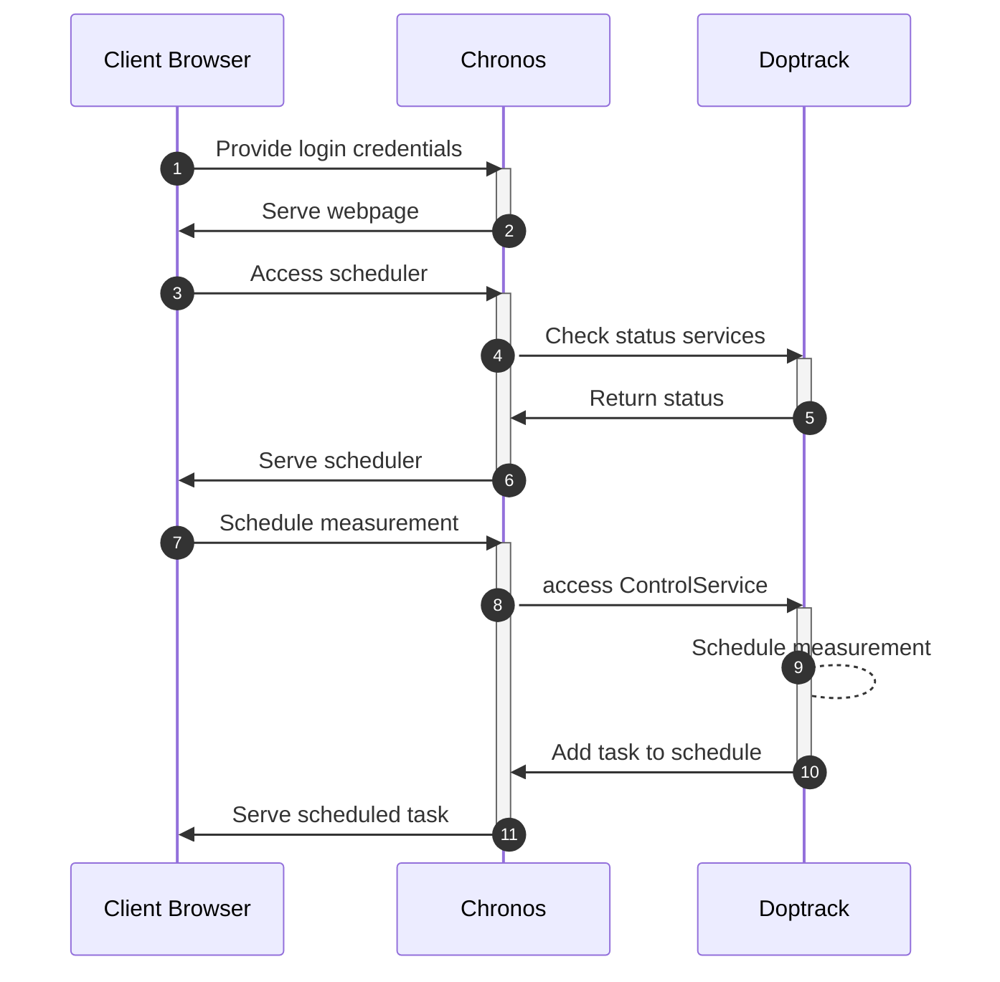

# Doptrack server setup

This folder contains the scripts for setting up the services on the doptack hardware server (doptrack.tudelft.nl).

To set up the services, copy the contents of this folder to the server and run `setup_services.sh`.

The following services will be started:
- MonitorService: sends data to the client when the server status changes
- ControlService: responds to requests of the clients 
- ReceiverService: service to handle mutliple receiver requests from the MonitorService and the ControlService. Problems might occur when the hardware is accessed by both services at the same time.

The two services are secured with certificates. 
- The doptrack server requires server.crt, server.key, and client.crt (not client.key)
- The client/data server requires server.crt, client.key, and client.crt (not server.key)
- The ReceiverService does not require certificates as it will only handle internal connections. It will disconnect services other than coming from 127.0.0.1.

## Sequence diagram for scheduling measurement

 